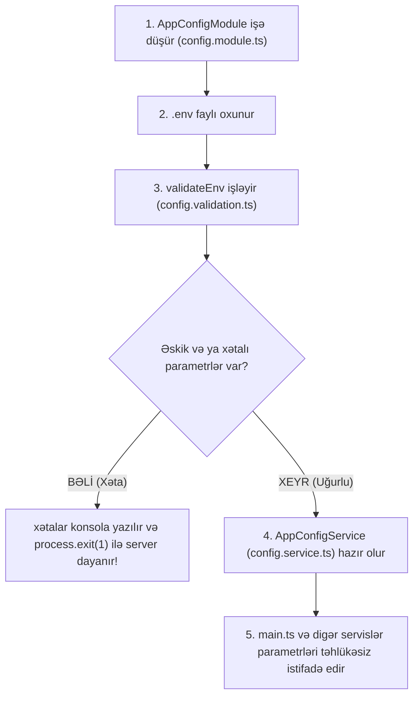

# 📚 Master Müəllim Dərsi: `libs/config/src/lib` İzahı

Salam tələbəm! 👨‍🏫 Bu sənəddə biz `libs/config/src/lib` daxilində olan 3 vacib faylı addım-addım, bənd-bənd və kod-kod birlikdə incələyirik.

Məqsədimiz odur ki, sən bu kodları sadəcə "copy-paste" etməyəsən, backend proqramçısı kimi hər sətirin nə üçün yazıldığını dəqiq anlayasan.

---

## 🧭 İcra Ardıcıllığı Və İşləmə Məntiqi

Server başladılan zaman iş zənciri bu ardıcıllıqla gedir:



Gəl indi bu 3 faylı bir-bir ələ alaq!

---

## 1️⃣ Birinci Adım: `config.validation.ts` (Sərhəd Keçid Məntəqəsi 🛡️)

Bu faylı tətbiqin **gömrük/sərhəd keçid məntəqəsi** kimi düşün. `.env` faylından gələn hər bir məlumat burada ciddi yoxlamadan keçir. Əgər 1 parametr belə yanlışdırsa, tətbiq içəri buraxılmır (server işə düşmür).

### 📍 1.1. Mühitlərin Təyini (`enum Environment`)
```typescript
enum Environment {
  Development = 'development',
  Production = 'production',
}
```
* **İzahı:** Layihənin yalnız 2 vəziyyətdə (`development` və ya `production`) ola biləcəyini məhdudlaşdırır. Əgər kimsə `.env`-də `NODE_ENV=test123` yazarsa, kod bunu dərhal rədd edəcək.

---

### 📍 1.2. `EnvironmentVaribale` Klassı Və Qaydalar (Class-Validator)
```typescript
class EnvironmentVaribale {
  @IsEnum(Environment, { message: 'NODE_ENV must be either production or development' })
  @IsNotEmpty({ message: 'NODE_ENV is required' })
  NODE_ENV!: Environment;

  @Type(() => Number)
  @IsNumber({}, { message: 'PORT must be a valid number' })
  @Min(1000, { message: 'PORT must be at least 1000' })
  @Max(65535, { message: 'PORT must be less than 65535' })
  PORT!: number;
```
* **`@Type(() => Number)`**: `.env` faylındakı bütün məlumatlar mətn (string) kimi oxunur (məs: `"3000"`). Bu dekorator onu həqiqi TypeScript ədədinə (`3000`) çevirir.
* **`@Min(1000)` & `@Max(65535)`**: Port nömrəsinin məntiqə uyğun diapazonda olmasını təmin edir.

```typescript
  @Transform(({ value }) =>
    typeof value === 'string'
      ? value.split(',').map((origin: string) => origin.trim())
      : []
  )
  @IsArray()
  @ArrayNotEmpty()
  @IsString({ each: true })
  @Matches(/^https?:\/\/.+$/, { each: true })
  @ValidateIf((env) => env.NODE_ENV === 'production')
  @NotEquals('*')
  ALLOWED_ORIGINS!: string[];
```
* **`@Transform`**: `.env`-dəki `ALLOWED_ORIGINS=http://localhost:3000,https://myapi.com` mətnini vergülə görə bölərək massivə (array) çevirir: `['http://localhost:3000', 'https://myapi.com']`.
* **`@ValidateIf((env) => env.NODE_ENV === 'production')`**: Bu çox vacibdir! Dəyərlərin yoxlanmasını YALNIZ layihə `production` rejimində olduqda məcbur edir. `development`-də bu yoxlama istəyə bağlı olur.

---

### 📍 1.3. Yoxlama Və Xəta Çıxarma Funksiyası (`validateEnv`)
```typescript
export function validateEnv(config: Record<string, unknown>) {
  logger.debug('Validating Environment varibale is in progress...');

  // 1. Boş mətni ("") undefined edirik ki, @IsNotEmpty onları tuta bilsin
  const cleanConfig = Object.entries(config).reduce((acc, [key, value]) => {
    acc[key] = value === '' ? undefined : value;
    return acc;
  }, {} as Record<string, unknown>);

  // 2. Xam obyekti klass instansiyasına çeviririk
  const validateConfig = plainToInstance(EnvironmentVaribale, cleanConfig, {
    enableImplicitConversion: true,
  });

  // 3. Yoxlayırıq
  const errors = validateSync(validateConfig, { skipMissingProperties: false });

  // 4. Əgər xəta varsa, serveri DƏRHAL DAYANDIRIRIQ!
  if (errors.length > 0) {
    const formattedErrors = formatValidationError(errors);
    logger.error('Environment Validation Failed');
    logger.error(formattedErrors);

    console.error(`\n ✗ Please fix the above env varibale in your .env file\n`);
    process.exit(1); // 🔴 Serveri dayandırır!
  }
  logger.log('✓ Environment varibale validated successfully');
}
```
* **Əsas Məntiq:** Əgər 1 parametr unudulubsa və ya yanlışdırsa, `process.exit(1)` çağırılır. Tətbiq xətalı parametr ilə İŞƏ DÜŞMÜR. Bu, müəssisə səviyyəli (enterprise) standartdır.

---

## 2️⃣ İkinci Adım: `config.service.ts` (Məlumat Paylayıcı Servis 🚚)

Validation uğurla keçdikdən sonra bu servis işə düşür. Bu servisin vəzifəsi dəyişənləri bütün proyektə **səliqəli qruplar şəklində və tip təhlükəsizliyi ilə** paylamaqdır.

### 📍 2.1. Qruplaşdırılmış Getter-lər (`appConfig`, `dbConfig`, `authConfig`)
```typescript
@Injectable()
export class AppConfigService {
  constructor(private readonly configService: ConfigService) { }

  get appConfig(): AppConfig {
    return {
      nodeEnv: this.configService.getOrThrow<'development' | 'production'>('NODE_ENV'),
      port: this.configService.getOrThrow<number>('PORT'),
      allowedOrigin: this.configService.getOrThrow<string[]>('ALLOWED_ORIGINS'),
    };
  }

  get dbConfig() {
    return {
      dbname: this.configService.getOrThrow<string>('DB_NAME'),
      dburl: this.configService.getOrThrow<string>('DB_URL'),
      poolsize: this.configService.getOrThrow<number>('POOL_SIZE'),
    };
  }
```
* **Niyə `getOrThrow()`?** Standart `get('PORT')` istifadə etdikdə qaytarılan tip `number | undefined` olur. Biz `getOrThrow()` işlətdikdə NestJS bilir ki, bu dəyər MÜTLƏQ var və tipi dəqiq `number`-dir!
* **Niyə Qruplaşdırırıq?** Bazaya qoşulacaq servis bütün `.env`-i deyil, yalnız `this.configService.dbConfig` obyekti götürür. Kod təmiz və oxunaqlı olur.

---

### 📍 2.2. Ağıllı Vaxt Çeviricisi (`timeStringToMilliseconds`)
```typescript
  private timeStringToMilliseconds(timeStr: string): number {
    const daysMatch = timeStr.match(/(\d+)d/);
    const hoursMatch = timeStr.match(/(\d+)h/);
    const minutesMatch = timeStr.match(/(\d+)m/);

    const days: number = daysMatch ? parseInt(daysMatch[1]) : 0;
    const hours: number = hoursMatch ? parseInt(hoursMatch[1]) : 0;
    const minutes: number = minutesMatch ? parseInt(minutesMatch[1]) : 0;

    return days * 24 * 60 * 60 * 1000 + hours * 60 * 60 * 1000 + minutes * 60 * 1000;
  }
```
* **Niyə Lazımdır?** `.env`-də biz daha çox insan oxuya bilsin deyə `JWT_ACCESS_TOKEN_EXPIRES_IN=7d` (7 gün) və ya `15m` (15 dəqiqə) yazırıq.
* **Necə işləyir?** RegEx vasitəsilə `7d` içindəki `7`-ni tapır, onu `24 * 60 * 60 * 1000` ilə vuraraq millisekund ədədinə (`604800000 ms`) çevirir. JWT kitabxanasına birbaşa ədəd verə bilirik.

---

## 3️⃣ Üçüncü Adım: `config.module.ts` (Birləşdirici Və İşə Salan Modul ⚙️)

Bu fayl bütün bu sistemi NestJS-ə qeyd edən əsas moduldur.

```typescript
const env = process.env['NODE_ENV'] || 'development';

const envFilePath = path.resolve(
  process.cwd(),
  'libs/config/src/env',
  `${env}.env`
);

@Global()
@Module({
  imports: [
    ConfigModule.forRoot({
      isGlobal: true,
      envFilePath,
      cache: true,
      expandVariables: true,
      validate: (config: Record<string, unknown>) => {
        validateEnv(config as Record<string, any>);
        return config;
      },
    }),
  ],
  providers: [AppConfigService],
  exports: [AppConfigService],
})
export class AppConfigModule {}
```

### 💡 Müəllim İzahı:
1. **`envFilePath`**: `NODE_ENV` göstəricisinə əsasən avtomatik olaraq `development.env` və ya `production.env` faylının yolunu qurur.
2. **`@Global()`**: Bu modulu qlobal edir. Artıq istənilən başqa modulda təkrar `imports: [AppConfigModule]` yazmağa ehtiyac qalmır.
3. **`validate` Funksiyası**: `ConfigModule.forRoot` faylı oxuyan kimi avtomatik bizim `validateEnv` funksiyamızı çağırır və yoxlamadan keçirir.
4. **`exports: [AppConfigService]`**: `AppConfigService`-i digər modulların istifadəsi üçün təqdim edir.

---

## 🎓 Müəllimdən Yekun Xülasə

| Fayl | Müəllim Tərifi | Əsas Vəzifəsi |
| :--- | :--- | :--- |
| **`config.validation.ts`** | 🛡️ Sərhədçi / Qapıçı | `.env` faylını oxuyur, yoxlayır, səhv varsa serveri dayandırır. |
| **`config.service.ts`** | 🚚 Kuryer / Paylayıcı | Məlumatları tip güvənliyi ilə qruplayır (`dbConfig`, `authConfig`). |
| **`config.module.ts`** | ⚙️ Mərkəzi Motor | Sistemi NestJS-ə qlobal olaraq qoşur və işə salır. |

Artıq bu 3 faylın necə birgə zəncirvari işlədiyini tam bilirsən! 🚀
