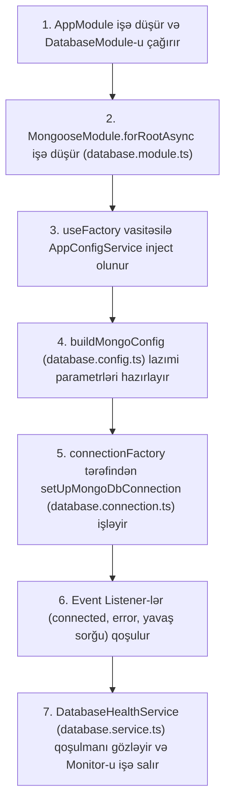

# 🎓 Enterprise MongoDB Database Master Guide (`libs/database`)

Salam tələbəm! 👨‍🏫 Əgər hind dərsliklərinə baxıb kopyaladıqdan sonra *"Burada nə baş verir, bu qədər kod nə üçündür?"* deyə düşünürsənsə, tam rahat ol! Bu ÇOX NORMALDIR. Çünki burada adi başlanğıc dərslərindəki kimi sadə `MongooseModule.forRoot('mongodb://...')` yazılmayıb. Əvəzində bank və iri elektron ticarət sistemlərində istifadə olunan **Professional Enterprise Mongoose Arxitekturası** qurulub.

Bu sənəddə biz `libs/database/src/lib` daxilindəki hər bir faylı, hər bir metodu və xüsusən `useFactory`, `connectionFactory` kimi məfhumları addım-addım, ən sadə dildə öyrənirik.

---

## 🧭 1. Ümumi İşləmə Xəritəsi Və Arxitektura

Server başladılan zaman verilənlər bazası sistemi bu zəncirvari ardıcıllıqla işə düşür:



---

## 🔬 2. Fayl-Fayl Və Kod-Kod Dərin Müəllim İzahı

---

### 📄 2.1. `database.module.ts` — Mərkəzi Qoşulma Qovşağı (ƏN VACİB FAYL 🌟)

Gəl ilk növbədə bütün sistemin "ürəyi" olan `database.module.ts` faylına baxaq:

```typescript
@Module({
  imports: [
    ConfigModule,
    MongooseModule.forRootAsync({
      imports: [ConfigModule],
      inject: [AppConfigService],
      useFactory: async (appConfig: AppConfigService) => {
        return {
          ...buildMongoConfig(appConfig),
          connectionFactory: (connection: Connection) =>
            setUpMongoDbConnection(
              connection,
              appConfig.dbConfig.dbname,
              appConfig.isProduction
            ),
        };
      },
    }),
  ],
  controllers: [DatabaseController],
  providers: [DatabaseHealthService],
  exports: [MongooseModule],
})
export class DatabaseModule {}
```

#### ❓ Niyə `forRoot()` Əvəzinə `forRootAsync()` Yazdıq?
* **Sadə `forRoot()`:** Mongoose-a sabit (static) string vermək üçündür. Məsələn: `forRoot('mongodb://localhost:27017')`. Lakin bizim `DB_URL` `.env` faylındadır və onu `AppConfigService` oxuyur!
* **Asinxron `forRootAsync()`:** NestJS-ə deyir ki: *"Gözlə! Baza qoşulma linki dərhal əlimizdə yoxdur. Əvvəlcə `AppConfigService` yüklənsin, sonra onun içindən `.env` məlumatlarını oxuyub bazaya qoşularsan."*

#### ❓ `inject: [AppConfigService]` Nə Edir?
* NestJS-in Dependency Injection (DI) sisteminə deyir ki: *"Bizə `useFactory` funksiyasının daxilində `AppConfigService` lazım olacaq. Gedib həmin servisi tap və parametri funksiyaya ötür."*

#### ❓ `useFactory: async (appConfig: AppConfigService) => { ... }` Nə Deməkdir?
* **Müəllim Tərifi:** `useFactory` — xüsusi fabriki (factory function) xatırladır. NestJS bu funksiyanı çağırır, parametr olaraq `appConfig`-i verir və cavabında Mongoose üçün lazım olan bütün konfiqurasiya obyektini alır.
* **Məntiqi:** `buildMongoConfig(appConfig)` çağırılaraq baza adını, linkini, taymautları və hovuz ölçülərini Mongoose-a qaytarır.

#### ❓ `connectionFactory: (connection: Connection) => { ... }` Nə Edir?
* **Mütəxəssis Qeydi:** Mongoose bazaya həqiqi socket bağlantısı (connection) açan kimi NestJS bu `connectionFactory` funksiyasını işə salır.
* Biz də həmin `connection` obyektini götürüb `setUpMongoDbConnection(...)` funksiyasına veririk ki, bazaya qoşuldu, ayrıldı və ya xəta verdi kimi event-ləri dinləyə bilək!

---

### 📄 2.2. `database.config.ts` — Konfiqurasiya Fabriki (`buildMongoConfig`)

Bu fayl Mongoose üçün lazım olan bütün incə tənzimləmələri hesablayır və qaytarır.

```typescript
export function buildMongoConfig(config: AppConfigService): MongooseModuleFactoryOptions {
  const dburl = config.dbConfig.dburl;
  const dbname = config.dbConfig.dbname;
  const poolSize = config.dbConfig.poolsize;
  const minPoolSize = Math.floor(poolSize * 0.2);
```

#### 📍 Sətir-Sətir Parametrlərin Mənaları:

1. **`maxPoolSize` & `minPoolSize` (Connection Pool - Bağlantı Hovuzu)**: 
   * **Dərin İzah:** Hər dəfə istifadəçi gələndə sıfırdan bazaya zəng edib parol yoxlamaq 100-300ms vaxt itkisinə və serverin dondurulmasına səbəb olur.
   * **`maxPoolSize` (10):** Pik vaxtlarda eyni anda açıq saxlanıla biləcək maksimum 10 xətt/kanal.
   * **`minPoolSize` (2):** Hətta gece saat 3-də sayta **heç kəs girməsə belə**, arxa fonda minimum 2 dənə qoşulma xətti həmişə "isti" və hazır açıq saxlanılır. İlk gələn müştəri 0ms gecikmə ilə anında cavab alır!

2. **`serverSelectionTimeoutMS: isProduction ? 30000 : 5000`**:
   * Əgər baza serveri çöksə, tətbiq neçə millisaniyə gözləsin? Production-da 30 saniyə, lokal testdə isə dərhal xəta versin deyə 5 saniyə!

3. **`autoIndex: !isProduction` & `autoCreate: !isProduction`**:
   * **Production Təhlükəsizliyi:** Production-da Mongoose-un avtomatik indeks yaratmasını söndürürük (`false`). Çünki 1 milyonluq bazada avtomatik indeks yaratmaq bazanı saatlarla dondura bilər!

4. **`tls: isProduction` & `tlsAllowInvalidCertificates: false`**:
   * **Şifrələmə Və Sertifikat (TLS/SSL):** Production mühitində backend ilə MongoDB arasındakı bütün məlumat axınını HTTPS kimi şifrələyir. Keçərsiz və saxta SSL sertifikatlarını dərhal rədd edir (`tlsAllowInvalidCertificates: false`).

5. **`readPreference: 'primaryPreferred'`**:
   * **Oxuma Üstünlüyü:** Oxuma sorğularını (məs: məhsul siyahısı) əsas baza serverindən (`Primary`) et. Əgər əsas server aşırı yüklənibsə və ya müvəqqəti əlçatmazdırsa, dərhal ehtiyat nüsxə serverlərdən (`Secondary`) oxu. Oxuma sorğuları heç vaxt dayanmır!

6. **`w: 'majority'` & `journal: true`**:
   * **Məlumat İtkisinin Qarşısını Almaq (Write Concern):** Yeni məlumat yazılarkən (məs: sifariş yaradılanda) MongoDB klasterindəki serverlərin əksəriyyəti (`majority`) məlumatın yazıldığını təsdiqləyənə və jurnal faylına (`journal: true`) qeyd olunana qədər gözləyir. Elektrik kəsilsə belə, məlumat itmir.

7. **`compressors: ['zlib']` & `zlibCompressionLevel: 6`**:
   * **Şəbəkə Sıxışdırılması:** Baza ilə backend arasında gedib-gələn iri JSON məlumatlarını ZLib vasitəsilə sıxışdıraraq (1MB-lıq məlumatı 100KB-a endirərək) şəbəkə bandwidth-inə qənaət edir. `6` dərəcəsi optimal performans təmin edir.

---

### 📄 2.3. `database.connection.ts` — Bağlantı Dinləyiciləri (`setUpMongoDbConnection`)

Bu fayl MongoDB bağlantısının həyat dövrünü (lifecycle) izləyir:

```typescript
export function setUpMongoDbConnection(connection: Connection, dbname: string, isProduction: boolean) {
  const logger = new Logger('MongoConnection');

  connection.on('connected', () => logger.log(`MongoDB connected to ${dbname}`));
  connection.on('disconnected', () => logger.log(`MongoDB disconnected from ${dbname}`));
  connection.on('reconnected', () => logger.log(`MongoDB is reconnected to ${dbname}`));
  connection.on('error', (err) => logger.log(`MongoDB connection error: ${err.message}`));
  connection.on('close', () => logger.log(`MongoDB connection close`));

  if (isProduction) registerQueryMonitoring(connection, logger);

  return connection;
}
```
* **Məntiqi:** Bazaya qoşulma baş verəndə, bağlantı qələndə və ya xəta olduqda terminalda gözəl loqlar çıxarır.
* Production mühitində avtomatik olarak yavaş sorğuların izlənməsini (`registerQueryMonitoring`) aktivləşdirir.

---

### 📄 2.4. `database.monitoring.ts` — Yavaş Sorğuları Tutan Sistem (`registerQueryMonitoring`)

Proyekt böyüdükdə bəzi baza sorğuları 2-3 saniyə çəkir və tətbiqi ləngidir. Bu fayl həmin yavaş sorğuları tutur:

```typescript
export function registerQueryMonitoring(connection: Connection, logger: Logger) {
  const querryTime = new Map<string, number>();

  connection.on('commandStarted', (event) => {
    if (['find', 'aggregate', 'delete', 'update', 'insert'].includes(event.commandName)) {
      querryTime.set(event.requestId.toString(), Date.now());
    }
  });

  connection.on('commandSucceded', (event) => {
    const req = event.requestId.toString();
    const start = querryTime.get(req);
    if (start) {
      const duration = Date.now() - start;
      querryTime.delete(req);
      if (duration > 1000) {
        logger.warn(`Slow querry detected: ${event.commandName} took ${duration}ms`);
      }
    }
  });
}
```
* **Necə İşləyir?**
  1. Baza sorğusu başlayan kimi (`commandStarted`) sorğunun ID-sini və başlama vaxtını `Map`-ə yazır.
  2. Sorğu bitəndə (`commandSucceded`) arada keçən vaxtı ölçür (`duration`).
  3. Əgər sorğu 1 saniyədən (`1000ms`) çox çəkibsə, konsola xəbərdarlıq vurur: `Slow querry detected: find took 1250ms`.

---

### 📄 2.5. `database.service.ts` — Baza Servisi Və Gözləmə Məntiqi

```typescript
@Injectable()
export class DatabaseHealthService implements OnModuleDestroy, OnModuleInit {
  constructor(@InjectConnection() private readonly connection: Connection) { }

  async onModuleInit() {
    this.checker = new DatabaseHealthChecker(this.connection);
    await this.waitForConnection();
    this.monitor = new DatabaseHealthMonitor(this.checker, 30000);
    this.monitor.start();
  }

  async onModuleDestroy() {
    this.monitor.stop();
    await this.connection.close();
  }

  private waitForConnection(): Promise<void> {
    return new Promise((resolve) => {
      if (this.connection.readyState === 1) return resolve();
      this.connection.once('connected', () => resolve());
    });
  }
}
```
* **`waitForConnection()` Məntiqi:** NestJS işə düşərkən baza bağlantısı tam tamamlanana qədər gözləyir. Bağlantı olan kimi monitorinqi işə salır.
* **`onModuleDestroy()`:** Tətbiq bağlandıqda (məs: server söndürüləndə) taymerləri dayandırır və baza qoşulmasını səliqəli bağlayır.

---

### 📄 2.6. `database.controller.ts` — HTTP Endpoint (`/api/db-health`)

```typescript
@Controller('db-health')
export class DatabaseController {
  constructor(private readonly databaseHealthService: DatabaseHealthService) { }

  @Get()
  async healthCheck() {
    const res = await this.databaseHealthService.checkHealth();
    return res;
  }
}
```
* Sən brauzerdən və ya Postman-dan `GET /api/db-health` istəyi atdıqda bazanın sağlamlıq metrikalarını (status, ping latensiyası, server versiyası) JSON formatında alırsan.

---

## 🎯 3. Müəllimdən Yekun Xülasə Və Tövsiyə

| Fayl | Müəllim Tərifi | Əsas Vəzifəsi |
| :--- | :--- | :--- |
| **`database.module.ts`** | ⚙️ Mərkəzi Qovşaq | `forRootAsync` və `useFactory` ilə `AppConfigService`-dən `.env`-i oxuyub Mongoose-u işə salır. |
| **`database.config.ts`** | 🛠️ Konfiqurasiya Fabriki | Pool size, taymautlar, TLS/SSL, Write Concern və zlib sıxışdırmasını hesablayır. |
| **`database.connection.ts`** | 🔌 Əlaqə Dinləyici | `connected`, `error` event-lərini izləyir. |
| **`database.monitoring.ts`** | ⏱️ Saniyəölçən | 1 saniyədən yavaş çəkən sorğuları tutur. |
| **`database.service.ts` & `controller.ts`** | 🩺 Sağlamlıq İnspektoru | Bazanın canlı statusunu yoxlayır və `/api/db-health` endpoint-inə ötürür. |

Artıq gördüyün kimi, bu kodların heç biri qorxulu deyil. Hamısı layihənin daha sürətli, təhlükəsiz və peşəkar işləməsi üçün zəncirvari qurulub! 🚀
