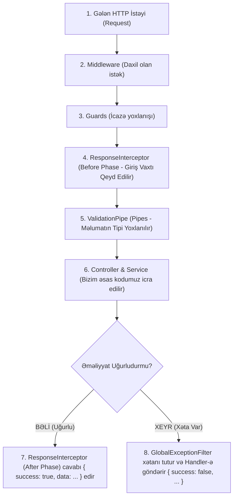

# 🗺️ Master Guide: `libs/utils` Arxitekturası Və İcra Zənciri

Salam tələbəm! 👨‍🏫 Bu sənəddə biz `libs/utils` kitabxanasının ümumi necə işlədiyini, bir HTTP istəyi gəldikdə kodun hansı sıradan keçdiyini, **Interceptor Və Filter-in nə zaman işə düşdüyünü** və bu kitabxanaları başqa proyektdə necə istifadə edə biləcəyini öyrənirik.

---

## 🧭 1. NestJS-də Bir İstəyin (HTTP Request) İcra Zənciri

Təsəvvür et ki, istifadəçi brauzerdən `GET /api/db-health` və ya `POST /api/users` istəyi atır. Kod zənciri dəqiq bu sırayla işləyir:



---

## ❓ 2. Nə Zaman Interceptor, Nə Zaman Filter/Handler Çalışır?

* **`ResponseInterceptor` (Uğur Keşikçisi):**
  * Nə zaman çalışır? Sorğu **UĞURLA** başa çatdıqda (Status code: 200, 201 və s.).
  * Nə edir? Kontrollerin qaytardığı məlumatı götürür, üzərinə `success: true`, status kodu, dəqiq vaxtı və icra müddətini (ms) əlavə edib brauzerə yola salır.

* **`GlobalExceptionFilter` & `Handler` (Xəta Qapıçısı):**
  * Nə zaman çalışır? Sorğu zamanı **XƏTA** baş verdikdə (Məs: bazaya qoşulmadı, parol yanlışdır, unikal e-poçt təkrar daxil edildi, 404 tapılmadı).
  * Nə edir? Xətanı tutur, növünə görə `handler/` qovluğundakı uyğun funksiyaya ötürür və brauzerə `success: false` olan standart JSON xəta hesabatı göndərir.

---

## ❓ 3. Bu Modulları (`utils`, `logger`, `config`) Başqa Layihədə İstifadə Edə Bilərəm?

### **BƏLİ! MÜTLƏQ VƏ TAMAMİLƏ BƏLİ! 🎯**

Bu modulların ən böyük gözəlliyi onların **Modulyar Və Müstəqil (Decoupled)** olmasındadır.

* `libs/logger` (Winston fayl loqqeri),
* `libs/config` (Sərt .env validation sistemi),
* `libs/utils` (Qlobal xəta filtri və interceptor)

Bu 3 kitabxana müəssisə səviyyəli (Enterprise) **Skelet Modullardır (Boilerplate)**. Sabah yeni bir NestJS və ya Nx layihəsinə başlayanda bu 3 qovluğu olduğu kimi köçürüb `main.ts`-də qeydiyyatdan keçirməyin kifayətdir! 🚀

---

## 📄 `main.ts` Daxilində Qeydiyyat Sırası

`apps/api/src/main.ts` faylı daxilində bu modullar belə birləşdirilir:

```typescript
// 1. Validation Pipe
app.useGlobalPipes(
  new ValidationPipe({
    whitelist: true,
    forbidNonWhitelisted: true,
    transform: true,
  })
);

// 2. Global Exception Filter (Logger daxil edilir)
app.useGlobalFilters(new GlobalExceptionFilter(logger));

// 3. Global Response Interceptor (Logger daxil edilir)
app.useGlobalInterceptors(new ResponseInterceptor(logger));
```

---

## 🔬 4. Bizim Proyekt Üzrə Canlı Nümunə: Kod Addım-Addım Necə İcra Olunur?

Gəl `new-poster-parlor-api` proyektimizdə iki fərqli ssenariyə (Uğurlu sorğu və Xətalı sorğu) kod səviyyəsində baxaq:

---

### 🟢 Ssenari A: Uğurlu Sorğu — `GET /api/db-health`

1. **`apps/api/src/main.ts` (İnisializasiya):**
   * Server açılır, `bootstrap()` funksiyası işə düşür.
   * `app.useGlobalInterceptors(new ResponseInterceptor(logger))` və `app.useGlobalFilters(new GlobalExceptionFilter(logger))` vasitəsilə interceptor və filter qlobal olaraq NestJS sisteminə qoşulur.

2. **Brauzer Sorğu Atır:** `GET http://localhost:3000/api/db-health`

3. **`ResponseInterceptor` (Before Phase — Giriş):**
   * [`response.interceptor.ts`](file:///c:/Users/User/Desktop/nest_js_projects/1_poster_parlor/new-poster-parlor-api/libs/utils/src/interceptor/response.interceptor.ts) daxilindəki `intercept()` işə düşür.
   * Sorğunun gəldiyi an qeyd edilir: `const startTime = Date.now()`.

4. **`ValidationPipe`:**
   * Sorğunun gövdəsi (body/query) yoxlanılır (GET sorğusunda heç bir DTO olmadığı üçün rahat keçir).

5. **`DatabaseHealthController` Və `DatabaseHealthIndicator`:**
   * Sorğu [`database-health.controller.ts`](file:///c:/Users/User/Desktop/nest_js_projects/1_poster_parlor/new-poster-parlor-api/libs/database/src/lib/health/database-health.controller.ts) faylına çatır.
   * `check()` metodu işləyir və MongoDB bazasının vəziyyətini yoxlayır.
   * Kontroller sadə məlumat obyektini qaytarır: `{ database: { status: 'up' } }`.

6. **`ResponseInterceptor` (After Phase — Çıxış Zərfləmə):**
   * Kontrollerdən cavab uğurla qayıtdığı üçün `ResponseInterceptor`-in RxJS `.pipe(map(...))` hissəsi işə düşür.
   * Cavab belə standart formata salınır:
     ```json
     {
       "success": true,
       "statusCode": 200,
       "timestamp": "2026-09-22T17:00:00.000Z",
       "path": "/api/db-health",
       "duration": "14ms",
       "data": {
         "database": { "status": "up" }
       }
     }
     ```
   * Winston `logger.info()` vasitəsilə `logs/app-YYYY-MM-DD.log` faylına uğurlu log yazılır.
   * Cavab brauzerə 200 OK kimi çatdırılır! 🎯

---

### 🔴 Ssenari B: Xətalı Sorğu — Mövcud Olmayan Səhifə `GET /api/unknown-route`

1. **Brauzer Sorğu Atır:** `GET http://localhost:3000/api/unknown-route`

2. **`ResponseInterceptor` (Giriş):** `startTime` qeyd edilir.

3. **NestJS Router:** Marşrutu tapa bilmir və `NotFoundException` (404 Xətası) atır (throw edir).

4. **`GlobalExceptionFilter` Tutur (Intercepts Error):**
   * Xəta baş verdiyi üçün kontroller cavab qaytara bilmir. NestJS xətanı dərhal [`global-exception.filter.ts`](file:///c:/Users/User/Desktop/nest_js_projects/1_poster_parlor/new-poster-parlor-api/libs/utils/src/filter/global-exception.filter.ts) daxilindəki `catch()` metoduna ötürür.

5. **Xəta Yönləndirməsi (Handler Dispatch):**
   * Filter xətanın `HttpException` növündən olduğunu görür.
   * Dərhal `handler/` qovluğundakı [`http-exception.handler.ts`](file:///c:/Users/User/Desktop/nest_js_projects/1_poster_parlor/new-poster-parlor-api/libs/utils/src/filter/handler/http-exception.handler.ts) funksiyasına keçir.

6. **Cavab Standartlaşdırılır Və Loqlanır:**
   * Handler xətanı bu formata salır:
     ```json
     {
       "success": false,
       "statusCode": 404,
       "timestamp": "2026-09-22T17:00:00.000Z",
       "path": "/api/unknown-route",
       "error": {
         "name": "NotFoundException",
         "message": "Cannot GET /api/unknown-route"
       }
     }
     ```
   * Winston `logger.error()` vasitəsilə xəta `logs/error-YYYY-MM-DD.log` faylına qeyd olunur.
   * Brauzerə 404 HTTP Status Code ilə `success: false` JSON cavabı qaytarılır! 🛡️

