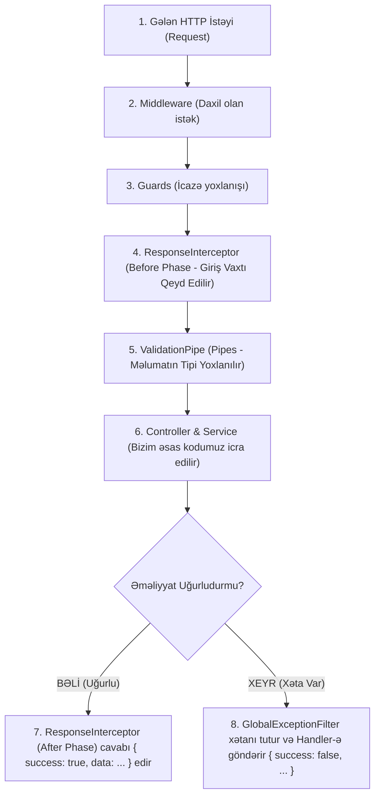

# 🗺️ Master Guide: `libs/utils` Arxitekturası Və İcra Zənciri

Salam tələbəm! 👨‍🏫 Bu sənəddə biz `libs/utils` kitabxanasının ümumi necə işlədiyini, bir HTTP istəyi gəldikdə kodun hansı sıradan keçdiyini, **Interceptor Və Filter-in nə zaman işə düşdüyünü** və bu kitabxanaları başqa proyektdə necə istifadə edə biləcəyini öyrənirik.

---

## 🧭 1. NestJS-də Bir İstəyin (HTTP Request) İcra Zənciri

Təsəvvür et ki, istifadəçi brauzerdən `GET /api/db-health` və ya `POST /api/users` istəyi atır. Kod zənciri dəqiq bu sırayla işləyir:



---

## ❓ 2. Nə Zaman Interceptor, Nə Zaman Filter/Handler Çalışır?

* **`ResponseInterceptor` (Uğur Keşikçisi):**
  * Nə zaman çalışır? Sorğu **UĞURLA** başa çatdıqda (Status code: 200, 201 və s.).
  * Nə edir? Kontrollerin qaytardığı məlumatı götürür, üzərinə `success: true`, status kodu, dəqiq vaxtı və icra müddətini (ms) əlavə edib brauzerə yola salır.

* **`GlobalExceptionFilter` & `Handler` (Xəta Qapıçısı):**
  * Nə zaman çalışır? Sorğu zamanı **XƏTA** baş verdikdə (Məs: bazaya qoşulmadı, parol yanlışdır, unikal e-poçt təkrar daxil edildi, 404 tapılmadı).
  * Nə edir? Xətanı tutur, növünə görə `handler/` qovluğundakı uyğun funksiyaya ötürür və brauzerə `success: false` olan standart JSON xəta hesabatı göndərir.

---

## ❓ 3. Bu Modulları (`utils`, `logger`, `config`) Başqa Layihədə İstifadə Edə Bilərəm?

### **BƏLİ! MÜTLƏQ VƏ TAMAMİLƏ BƏLİ! 🎯**

Bu modulların ən böyük gözəlliyi onların **Modulyar Və Müstəqil (Decoupled)** olmasındadır.

* `libs/logger` (Winston fayl loqqeri),
* `libs/config` (Sərt .env validation sistemi),
* `libs/utils` (Qlobal xəta filtri və interceptor)

Bu 3 kitabxana müəssisə səviyyəli (Enterprise) **Skelet Modullardır (Boilerplate)**. Sabah yeni bir NestJS və ya Nx layihəsinə başlayanda bu 3 qovluğu olduğu kimi köçürüb `main.ts`-də qeydiyyatdan keçirməyin kifayətdir! 🚀

---

## 📄 `main.ts` Daxilində Qeydiyyat Sırası

`apps/api/src/main.ts` faylı daxilində bu modullar belə birləşdirilir:

```typescript
// 1. Validation Pipe
app.useGlobalPipes(
  new ValidationPipe({
    whitelist: true,
    forbidNonWhitelisted: true,
    transform: true,
  })
);

// 2. Global Exception Filter (Logger daxil edilir)
app.useGlobalFilters(new GlobalExceptionFilter(logger));

// 3. Global Response Interceptor (Logger daxil edilir)
app.useGlobalInterceptors(new ResponseInterceptor(logger));
```
