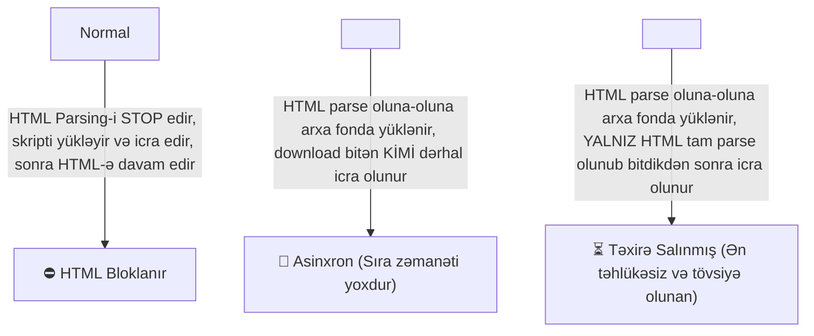

# 🗺️ Master Guide: JavaScript Architecture & Core Concepts

Salam əziz tələbəm! 👨‍🏫 İndi tam anladım! Sən sol menyuda olan **JavaScript Core Architecture** konsepsiyalarının **HƏMİSİNİ** (Event Loop, MicroTask, Call Stack, MacroTask, Execution Context, Promises, Async/Await, Closures, Generators) və onların bir-biri ilə necə işlədiyini öyrənmək istəyirsən. 

Gəl bu 9 əsas sütunu JavaScript-in daxili mühərrik sistemi kimi tam aydınlaşdıraq! 🚀

---

## 🏛️ JavaScript Engine Arxitekturası (Böyük Rəsm)

JavaScript **Single-Threaded** (Tək zolaqlı) bir dildir. Yəni eyni anda YALNIZ BİR İŞ görə bilər. Bəs necə olur ki, serverə istək atanda, fayl oxuyanda və ya taymer qoyanda səhifə donmur?

Bunu təmin edən sistem **JavaScript Execution Architecture** adlanır:

```mermaid
graph TD
    A["📚 Call Stack (Sinxron Kodlar İcra Olunur)"] -->|Asinxron Kod Qeydə Alınır| B["🌐 Web APIs / Node.js Kernel (Timer, Fetch, Events)"]
    B -->|Promise .then() / Microtask| C["⚡ MicroTask Queue (Yüksək Prioritet)"]
    B -->|setTimeout / I/O / Macrotask| D["🕒 MacroTask Queue (Standart Prioritet)"]
    C -->|1. Öncə BÜTÜN Microtask-lar təmizlənir| E["🔄 Event Loop (Trafik Polisi)"]
    D -->|2. Sonra YALNIZ 1 ƏDƏD Macrotask götürülür| E
    E -->|Call Stack BOŞDURSA işi bura atır| A
```

---

## 📚 1. Call Stack (İcra Qutusu / Mağaza)

* **Nədir?** JavaScript-in sinxron kodları icra etdiyi yığın qutusudur (**LIFO** — *Last In, First Out / Son Gələn İlk Çıxar*).
* **Necə İşləyir?** Bir funksiya çağırılanda Call Stack-in üstünə qoyulur (`push`), işini bitirdikdə stack-dən çıxarılır (`pop`).
* **Stack Overflow Nədir?** Əgər funksiya özünü rekurssiv olaraq sonsuz çağırarsa, Call Stack dolur və `RangeError: Maximum call stack size exceeded` xətası verir.

---

## ⚙️ 2. Execution Context (İcra Mühiti)

* **Nədir?** JavaScript kodunun işləməsi üçün hazırlanan xüsusi mühitdir. Hər bir funksiya çağırılanda yeni Execution Context yaradılır.
* **2 Mərhələdən Keçir:**
  1. **Creation Phase (Yaradılma Mərhələsi):** Kod icra olunmazdan əvvəl dəyişənlər üçün yaddaş ayrılır (**Hoisting** baş verir), `this` təyin olunur.
  2. **Execution Phase (İcra Mərhələsi):** Kod sətir-sətir oxunur və dəyərlər mənimsədilir.

---

## 🎈 2.1. Hoisting (Yuxarı Qaldırılma) Və TDZ

* **Nədir?** JavaScript mühərrikinin koda baxarkən **Creation Phase**-də dəyişən və funksiya elanlarını (declarations) faylın/mühitin ən yuxarısına "qaldırması" davranışıdır.

### 🔹 A) Function Declaration Hoisting:
Bütün funksiya elanı yuxarı qaldırıldığı üçün funksiyanı kodda elan etməzdən ƏVVƏL çağıra bilərsən:
```javascript
salamla(); // ✅ Çıxış: "Salam tələbəm!" (İşləyir!)

function salamla() {
  console.log("Salam tələbəm!");
}
```

### 🔹 B) `var` Hoisting:
`var` ilə elan edilən dəyişən yuxarı qaldırılır və avtomatik `undefined` dəyəri alır:
```javascript
console.log(x); // 🟢 Çıxış: undefined (Xəta vermir!)
var x = 5;
```

### 🔹 C) `let` / `const` Hoisting Və TDZ (Temporal Dead Zone):
`let` və `const` da yuxarı qaldırılır, LAKİN inisializasiya OLUNMUR! 
Dəyişənin elan edildiyi sətirə qədər olan zonaya **TDZ (Müvəqqəti Ölü Zolaq)** deyilir. Həmin aralıqda dəyişəni çağırsan brauzer xəta atacaq:
```javascript
console.log(y); // ❌ ReferenceError: Cannot access 'y' before initialization!
let y = 10;
```

---

## 🌐 2.2. HTML-də Skript Yüklənməsi: `normal` vs `async` vs `defer`

HTML səhifəsində `<script>` teqini yazarkən 3 fərqli davranış var:



| Metod | HTML Parsing-i Bloklayır? | Nə Vaxt İcra Olunur? | Sıralama Zəmanəti Var? | Ən Yaxşı İstifadə Yeri |
| :--- | :---: | :--- | :---: | :--- |
| **Normal `<script>`** | 🔴 BƏLİ | Görünən kimi dərhal yüklənir və icra olunur. | 🟢 BƏLİ | Köhnə layihələr |
| **`<script async>`** | 🟡 QİSMƏN | Arxa fonda yüklənir, **yüklənən kimi dərhal** icra olunur. | 🔴 XEYR | Google Analytics, Reklamlar |
| **`<script defer>`** | 🟢 XEYR | Arxa fonda yüklənir, **bütün HTML bitdikdə (DOMReady)** icra olunur. | 🟢 BƏLİ | Əsas App koda (React, Vue, JS) |

---

## 🔒 3. Closures (Qapalı Yaddaş Çantası)

* **Nədir?** Funksiyanın öz xarici (parent) leksik mühitindəki dəyişənləri, parent funksiya işini bitirib yaddaşdan silindikdən SONRA belə öz yaddaşında saxlaya bilməsi xüsusiyyətidir.
* **Nümunə:**
  ```javascript
  function xarici() {
    let say = 0;
    return function daxili() {
      say++;
      return say; // `say` dəyişəni Closure yaddaşında saxlanılır!
    };
  }
  ```

---

## 🔄 4. Event Loop (Trafik Polisi 🚦)

* **Nədir?** Single-threaded JavaScript-də asinxronluğu təmin edən sonsuz dövrdür.
* **Yeganə Vəzifəsi:** **Call Stack-i sürekli yoxlamaq!**
* **Qaydası:** Əgər Call Stack TAM BOŞDURSA:
  1. Əvvəlcə **MicroTask Queue**-da olan BÜTÜN tapşırıqları götürüb Call Stack-ə atır.
  2. MicroTask növbəsi tam boşaldıqdan sonra **MacroTask Queue**-dan YALNIZ 1 ƏDƏD tapşırıq götürüb Call Stack-ə atır.

---

## ⚡ 5. MicroTask Queue (Yüksək Prioritetli Növbə)

* **Nədir?** Tez icra olunmalı olan asinxron tapşırıqlar növbəsidir.
* **Tərkibinə Nələr Daxildir?**
  * `Promise.then()`, `.catch()`, `.finally()`
  * `queueMicrotask()`
  * Node.js-də `process.nextTick()`
* **Qayda:** Event Loop MicroTask növbəsində 1 dənə də olsun iş qalmayana qədər MacroTask-a KEÇMİR!

---

## 🕒 6. MacroTask Queue (Task Queue — Standart Növbə)

* **Nədir?** Ənənəvi, standart asinxron əməliyyatların növbəsidir.
* **Tərkibinə Nələr Daxildir?**
  * `setTimeout()`, `setInterval()`
  * `setImmediate()` (Node.js)
  * I/O (Fayl oxuma, Şəbəkə sorğuları)
  * UI Rendering / DOM Event-ləri (`click`, `scroll`)

---

## 🤝 7. Promises (Gələcək Vəd Obyekti)

* **Nədir?** Gələcəkdə tamamlanacaq asinxron əməliyyatın nəticəsini təmsil edən obyekt.
* **3 Halı Var:**
  1. `Pending` (Gözləyir - Hələ nəticə yoxdur)
  2. `Fulfilled` (Uğurla bitdi - `.then()` işə düşür)
  3. `Rejected` (Xəta baş verdi - `.catch()` işə düşür)
* **Qeyd:** `.then()` daxilindəki callback funksiyaları **MicroTask Queue**-ya göndərilir!

---

## ⏳ 8. Async / Await (Sintaktik Şəkər 🍬)

* **Nədir?** Promise-ləri daha oxunaqlı və sinxron kod kimi yazmağa imkan verən sintaksisdir.
* **İş Prinsipi:**
  * `async` funksiya avtomatik cavabı Promise obyektinə bükür.
  * `await` gördükdə mühərrik funksiyanın daxilindəki icranı **MicroTask-a ötürərək dondurur** və Promise cavab verənə qədər gözləyir.

```javascript
async function getData() {
  try {
    const res = await fetch('/api/data'); // Promise həll olunana kimi dondurur
    const data = await res.json();
    console.log(data);
  } catch (err) {
    console.error(err);
  }
}
```

---

## 🔋 9. Generators (`function*` + `yield`)

* **Nədir?** İcrası `yield` açar sözü ilə istənilən an **dondurula (Pause ⏸️)** və `.next()` metodu ilə **davam etdirilə (Resume ▶️)** bilən xüsusi funksiyadır.
* **Async/Await İlə Əlaqəsi:** `Async/Await` mexanizması əslində arxa fonda **Generators + Promises** kombinasiyası üzərində qurulub!

---

## ⚡ Bütün Bunların İcra Prioriteti Sıralaması (İmtahan Sualı! 🎯)

Təsəvvür et ki, kodda eyni anda hamısı var. İcra olunma sırası DƏQİQ bu cür olacaq:

1. 🥇 **Sinxron Kodlar (Call Stack):** Birinci düz sətir-sətir işləyir.
2. 🥈 **MicroTask Queue:** `Promise.then()`, `queueMicrotask()` sıranı götürür.
3. 🥉 **MacroTask Queue:** `setTimeout()` ən son icra olunur.

### 🧪 Canlı Test Kodu:

```javascript
console.log('1. Sinxron (Start)'); // 1. Call Stack

setTimeout(() => {
  console.log('4. MacroTask (setTimeout)'); // 3. MacroTask
}, 0);

Promise.resolve().then(() => {
  console.log('3. MicroTask (Promise)'); // 2. MicroTask
});

console.log('2. Sinxron (End)'); // 1. Call Stack
```

** Konsolda Çıxış Sırası:**
```text
1. Sinxron (Start)
2. Sinxron (End)
3. MicroTask (Promise)
4. MacroTask (setTimeout)
```

---

## 🧵 10. Main Thread Və JS Single-Threaded Olması Nə Deməkdir?

### ❓ Main Thread Nədir?
**Main Thread (Əsas İşçi İpi)** — Brauzerdə və ya Node.js-də JavaScript kodlarını oxuyan, istifadəçinin `click` / `scroll` kimi hərəkətlərinə cavab verən və HTML/CSS-i ekrana çəkən (rendering edən) **tək əsas fəhlədir**.

### ❓ Single-Threaded Nə Deməkdir?
JavaScript **Single-Threaded**-dir, yəni **eyni bir anda YALNIZ BİR İŞ görüb YALNIZ BİR KOD SƏTİRİNİ icra edə bilər**.

* **Çox zolaqlı dillər (C++, Java, Go):** Eyni anda 8-16 fərqli thread açaraq 16 işi parallel görə bilir.
* **JavaScript:** Tək bir zolaqda (Main Thread) işləyir.

### 💡 Bəs Asinxron İşlər (Timer, Fetch, File I/O) Necə Dondurulmur?
Məsələn, `fetch('/api/users')` edəndə serverdən cavab 2 saniyəyə gəlir. JavaScript tək işçidirsə, 2 saniyə boyunca brauzer niyə donmur?

Çünki JavaScript mühərriki həmin ağır şəbəkə sorğusunu özü gözləmir! Onu brauzerin **Web API** (və ya Node.js-in C++ daxili drayveri Libuv) bölməsinə tapşırır:
1. Main Thread: *"Mən kodlarımı oxumağa davam edirəm, sən arxa fonda serverə sorğunu at."*
2. Web API: Şəbəkə sorğusu bitdikdən sonra cavabı **MicroTask Queue**-ya qoyur.
3. Event Loop: Call Stack boşalan kimi həmin cavabı Main Thread-ə gətirir.

### ⚠️ UYARI: Main Thread-i Bloklamaq (Blocking the Main Thread)
Əgər sen Main Thread-də sonsuz dövr (`while(true)`) və ya 10 milyardlıq ağır riyazi hesablama aparsan, Main Thread dondurulacaq. İstifadəçi düyməyə klikləsə belə səhifə cavab verməyəcək (*"Page Unresponsive"* xətası).

---

## ⚔️ 11. Promise İlə Async / Await Arasındakı Fərq Nədir?

`Async / Await` əslində `Promise` üzərində qurulmuş **Sintaktik Şəkərdir (Syntactic Sugar)**. Hər ikisi asinxron əməliyyatları idarə edir, lakin istifadə tərzləri və oxunurluğu fərqlidir.

### 🔹 1. Sintaksis Və Oxunurluq:
* **Promise (`.then()` zənciri):**
  ```javascript
  function getUser() {
    fetch('/api/user')
      .then((res) => res.json())
      .then((user) => {
        console.log(user);
        return fetch(`/api/posts/${user.id}`);
      })
      .then((posts) => posts.json())
      .then((data) => console.log(data))
      .catch((err) => console.error(err));
  }
  ```
  *🔴 Çatışmazlığı:* Çoxlu `.then()` bir-birinin daxilinə girdikdə kod sağa doğru uzanır və oxunması çətinləşir (*"Promise Chaining Hell"*).

* **Async / Await:**
  ```javascript
  async function getUser() {
    try {
      const res = await fetch('/api/user');
      const user = await res.json();
      
      const postsRes = await fetch(`/api/posts/${user.id}`);
      const data = await postsRes.json();
      console.log(data);
    } catch (err) {
      console.error(err);
    }
  }
  ```
  *🟢 Üstünlüyü:* Kod tamamilə sinxron düz sətir oxunurmuş kimi təmiz və anlaşıqlı olur!

### 📊 Müqayisə Cədvəli:

| Xüsusiyyət | Promise (`.then() / .catch()`) | Async / Await |
| :--- | :--- | :--- |
| **Yazılış Tərzi** | Callback & Chaining (`.then()`) | Sinxron kimi düz sətir oxunur |
| **Xəta Tutulması (Error Handling)** | `.catch()` metodu ilə | Standart `try { ... } catch (err)` ilə |
| **Kod Oxunurluğu** | Çoxlu zəncirdə qarışıq ola bilər | Çox təmiz və oxunaqlı |
| **Arxitektura** | JavaScript Obyektidir | Promise + Generator sintaktik şəkəridir |
| **Şərt Budaqlanmaları (If/Else)** | `.then()` daxilində şərt yazmaq çətindir | Standart `if/else` kimi rahat yazılır |
